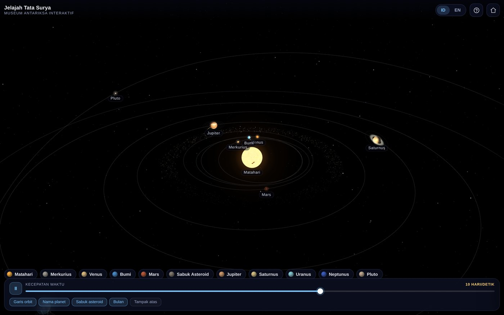
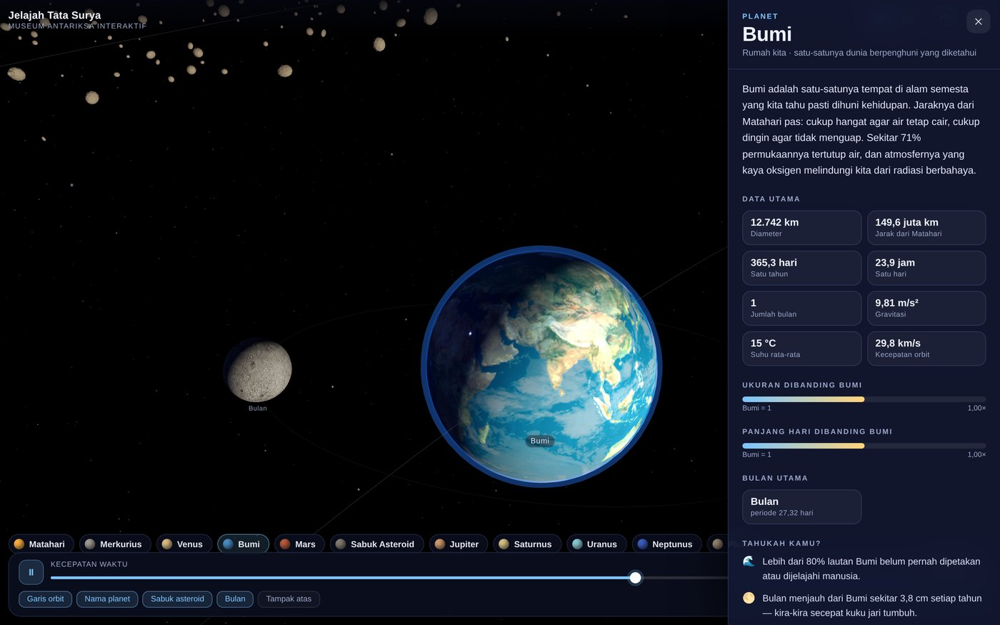
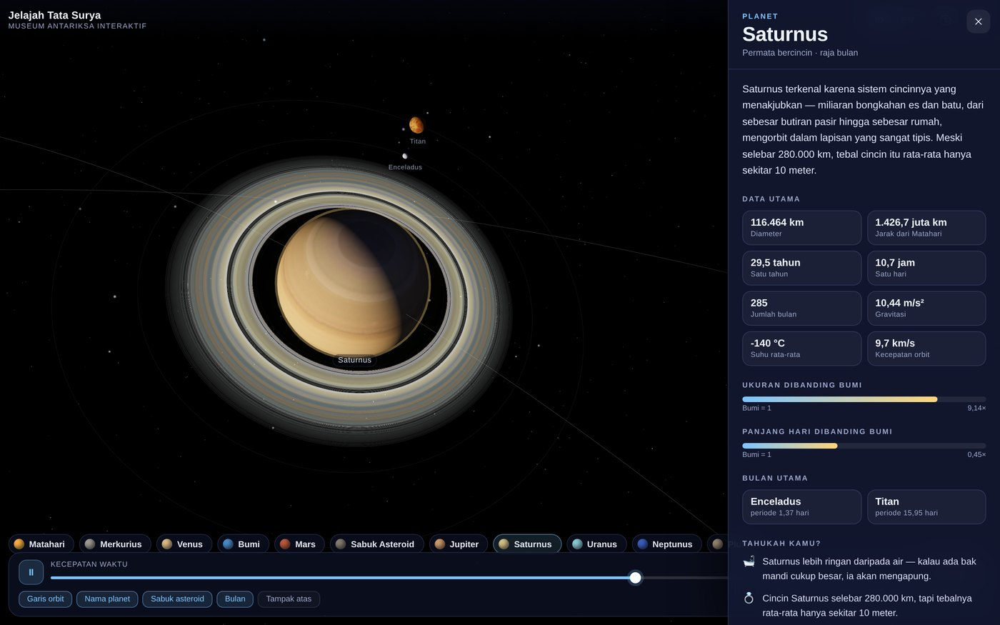
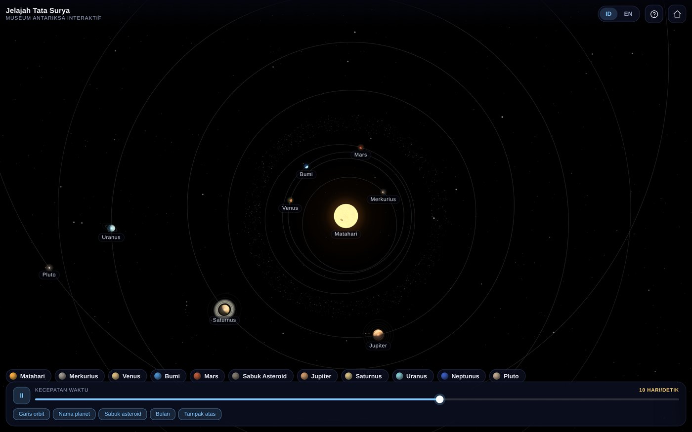
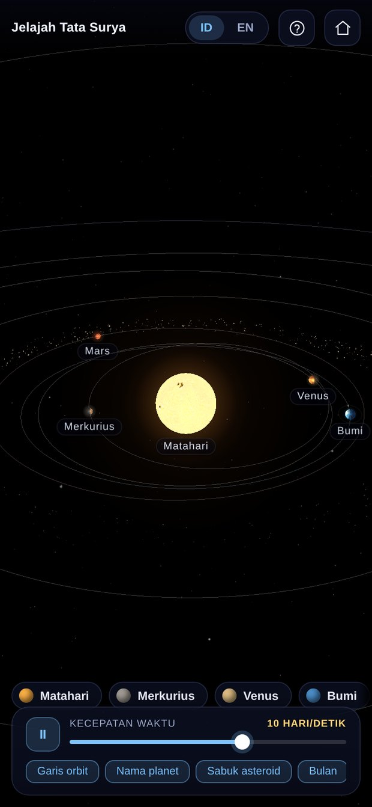

# 🪐 Solar Explorer

An interactive 3D solar-system simulation built for education — orbit it, zoom into it, and tap any planet for the full story. Bilingual (Indonesian / English), running from a single HTML file with no build step.



---

## ✨ Features

| | |
|---|---|
| 🌍 **10 celestial bodies** | The Sun, all 8 planets, and Pluto, wrapped in NASA photo textures |
| 🌙 **12 major moons** | The Moon, Io, Europa, Ganymede, Callisto, Titan, Enceladus, Triton, Titania, Charon, Phobos, Deimos |
| 💍 **Rings** | Saturn and Uranus, at their true axial tilts |
| ☄️ **Asteroid belt** | ~2,200 rocks with differential rotation following Kepler's Third Law |
| 🔭 **Real orbits** | Ellipses with true eccentricity & inclination, solved through Kepler's equation — planets genuinely slow down at aphelion |
| 🌗 **Rotation & tilt** | True rotation periods and axial tilts; Venus and Uranus spin retrograde |
| ⏱️ **Time control** | 0.01 – 600 days/second, with a pause button |
| 🔊 **Read aloud** | Every info panel can be narrated out loud in either language, highlighting each paragraph as it is read — for children who are not fluent readers yet |
| 🌐 **Bilingual** | The language is chosen on first launch (and remembered), and the ID/EN buttons switch the entire interface *and* all content at any time |
| 📄 **In-app credits** | A credits button in the top bar lists every data and texture source, with links |
| 📱 **Mobile-first** | The info panel becomes a bottom sheet, touch targets are enlarged, and the camera reframes itself automatically |

### Educational content

Every celestial body comes with:

- a short, kid-friendly description,
- a data table (diameter, distance, orbital & rotation period, moon count, gravity, temperature, orbital speed),
- a visual comparison against Earth,
- three fun facts,
- and a full explanation that expands for adult readers.

All of it is available completely in both Indonesian and English.

### Read-aloud narration

The **Bacakan / Read aloud** button in the info panel speaks the body's name, its short
description, and its three fun facts, highlighting each block as it goes. The long "full
explanation" is written for adults and is deliberately left out.

It uses the browser's built-in [Web Speech API](https://developer.mozilla.org/en-US/docs/Web/API/Web_Speech_API),
so there is no extra dependency, no API key, and no audio to download — it keeps working
offline once the device has a voice installed. The narration stops by itself when the panel is
closed, another body is selected, the language is switched, or the tab is hidden.

Voice quality is the device's, not the app's. Android, iOS, Windows and macOS all ship an
Indonesian voice; some desktop Linux browsers do not, and in that case the panel says so
instead of reading Indonesian text with an English voice and pretending it worked. The button
is hidden entirely on browsers without the API.

---

## 🚀 Getting started

Open `index.html` in any browser. No build step, no dependencies to install.

```bash
git clone https://github.com/YOUR-USERNAME/solar-explorer.git
cd solar-explorer
python3 -m http.server 8000
# open http://localhost:8000
```

> **An internet connection is required** to pull Three.js and the planet textures from a CDN.
> If they fail to load, the page shows a clear message instead of a loading screen that spins forever.

### GitHub Pages

This repo deploys as-is. Go to **Settings → Pages → Source: Deploy from a branch → `main` / `(root)`**, and the site goes live at `https://YOUR-USERNAME.github.io/solar-explorer/`.

**If you forked this repo, delete the `CNAME` file in the root first** — it carries the original author's custom domain and will hijack your deployment.

Want your own domain? Put it in `CNAME` (or set it under **Settings → Pages → Custom domain**) and add a `CNAME` DNS record pointing at `YOUR-USERNAME.github.io`. If your DNS sits behind a proxy — Cloudflare's orange cloud, for instance — leave the record unproxied until GitHub has issued the certificate, otherwise **Enforce HTTPS** never becomes available and the site can fail with an SSL error.

---

## 🖼️ Screenshots

| Earth & the Moon | Saturn |
|---|---|
|  |  |

| Top view | Mobile |
|---|---|
|  |  |

---

## 🛠️ Development

The source is split across three files in `src/`, then inlined into a single `index.html`:

```
src/index.template.html   HTML + CSS + UI structure
src/data.js               astronomical data & all bilingual copy
src/app.js                Three.js scene, camera, interaction, UI logic
```

```bash
python3 build.py           # bundle src/ → index.html
python3 build.py --check   # verify index.html is in sync with src/
```

Always edit the files in `src/`, then run `build.py`. Never edit `index.html` directly — it is generated.

### Adding a new celestial body

Add one object to the `BODIES` array in `src/data.js`. Display radius, orbital distance, and camera framing are all derived automatically from `radiusKm` and `dist` (in AU).

### A note on scale

Distances and sizes are deliberately **compressed** so that every planet fits on one screen:

```
display radius   = 1.40 × (R / R_earth) ^ 0.42
display distance = 18 + 30 × (AU ^ 0.55)
```

At true scale, Earth would be a single pixel and Neptune would sit a hundred screens away. The compression is explained inside the app (the "How to explore" guide and a note in every info panel) so it never becomes a misconception.

What is **not** compressed: orbital eccentricity, inclination, axial tilt, orbital period, and rotation period — those all use real figures.

---

## 📊 Data sources

- Planet figures: [NASA Planetary Fact Sheet](https://nssdc.gsfc.nasa.gov/planetary/factsheet/)
- Moon counts: [IAU Minor Planet Center](https://www.iau.org/) (March 2026 — Jupiter 101, Saturn 285)
- Planet textures: [threex.planets](https://github.com/jeromeetienne/threex.planets) by Jerome Etienne (MIT), assembled from NASA imagery and [Planet Pixel Emporium](https://planetpixelemporium.com/) by James Hastings-Trew
- 3D engine: [Three.js](https://threejs.org/) r180

Moon counts keep rising as new discoveries are confirmed — the app notes this in the panel of every planet with a large moon count.

The same list is available inside the app through the credits button (document icon) in the top bar; its contents live in the `CREDITS` array in `src/data.js`.

---

## 📄 License

Code: [MIT](LICENSE).

Planet textures are loaded at runtime from third-party repositories and remain subject to their own licences; they are not bundled in this repo.
